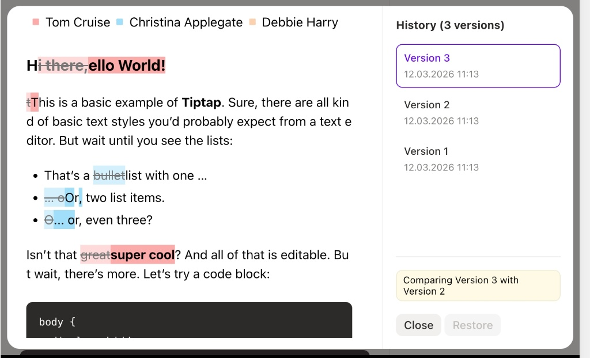

# Tiptap Snapshot-Compare 核心设计问题清单

> 背景：实现类似 https://tiptap.dev/docs/collaboration/documents/snapshot-compare 的功能。本文档面向 Tiptap / ProseMirror 新手，覆盖核心设计决策。

效果图

---

## 前置调研结论

- `prosemirror-changeset`（v2.3.0）已通过 `@tiptap/pm/changeset` 可用（tiptap 打包了但自身未使用）
- 提供 `ChangeSet`、`Change`、`Span` 类，用于基于 Steps 的变更追踪
- tiptap 生态中**不存在**官方的 diff/version/track-changes 扩展，snapshot-compare 是其付费 Collaboration 套件的一部分
- `prosemirror-history` 仅用于 undo/redo，不涉及文档版本管理

---

## 一、ProseMirror 文档模型基础

### 1. ProseMirror 的文档结构是什么？

- `Doc → Block Nodes → Inline Nodes → Marks` 的树形结构
- 文档本质是一棵不可变（immutable）的树，每次编辑产生新的树
- 需要理解 `Node`, `Fragment`, `Mark`, `Schema` 四个核心概念

### 2. `doc.toJSON()` 和 `Node.fromJSON(schema, json)` 是做什么的？

- 这是文档序列化/反序列化的基础，快照的存储就靠它
- JSON 格式代表了文档的完整结构（节点类型、属性、marks、内容）

### 3. 什么是 Step 和 Transform？

- `Step` 是 ProseMirror 中最小的文档变更单元（如 `ReplaceStep`, `AddMarkStep`）
- `Transform` 是一系列 Step 的集合
- diff 的底层原理是：给定文档 A 和文档 B，找出将 A 变成 B 所需的 Steps

---

## 二、快照（Snapshot）设计

### 4. 快照存什么？

- 最少需要存：`doc.toJSON()` 的结果（完整文档树的 JSON）
- 通常还存：快照 ID、创建时间、创建者、描述/标签
- 可选存储：当前 selection/cursor 位置

### 5. 快照存在哪？

| 方案 | 说明 | 适用场景 |
|------|------|----------|
| A: localStorage / IndexedDB | 前端本地存储 | PoC / 原型 |
| B: 后端数据库 | 持久化存储 | 生产环境 |
| C: Yjs `Y.Snapshot` | 利用 Yjs 自带版本快照能力 | 已有 Yjs 协同的项目 |

**需要决定**：当前项目是否涉及协同？是否已经有 Yjs？

### 6. 何时创建快照？

- 手动触发（用户点按钮）
- 自动触发（每隔 N 分钟 / 每次保存 / 文档闲置后）
- 关键事件触发（发布前、AI 生成后、导出前）

---

## 三、Diff 计算（核心难点）

### 7. `prosemirror-changeset` 是什么？能做什么？

- 已经通过 `@tiptap/pm/changeset` 可用（tiptap 打包了但自己没用）
- 提供 `ChangeSet` 类：给定一个起始文档和一系列 Steps，计算出变更范围
- 产出 `Change` 对象：`{ fromA, toA, fromB, toB, deleted, inserted }`
- **局限**：它需要的是 Steps（增量变更记录），不是直接拿两个独立文档 diff

### 8. 两个独立文档如何做 diff？

`prosemirror-changeset` 需要 Steps，但如果你只有两个 JSON 快照没有中间 Steps，你需要另一条路：

| 方案 | 说明 |
|------|------|
| A: `prosemirror-diff` | 社区库，直接基于两个 Doc 节点做 diff |
| B: JSON 结构化 diff | 使用 `json-diff` 类库对 `doc.toJSON()` 做 diff，再映射回文档位置 |
| C: 保存 Steps 链 | 保存每次编辑的 Steps，直接用 `prosemirror-changeset` |
| D: 文本 diff | 使用 `diff-match-patch` 做文本 diff，再映射回文档节点 |

**需要决定**：是否保存 Steps 历史？还是只存快照 JSON？

### 9. diff 的粒度应该是什么？

- **块级 diff**：以段落/标题/代码块为单位，标记整个块为新增/删除/修改
- **内联 diff**：以文字片段为单位，标记具体哪些文字新增/删除（类似 git diff 的绿色/红色）
- **结构 diff**：节点类型变化（如段落变成标题）、属性变化（如对齐方式变化）
- 越细粒度越复杂，建议先实现块级，再逐步细化

---

## 四、Diff 结果的可视化渲染

### 10. 如何在 Tiptap 编辑器中展示 diff？

| 方案 | 说明 | 特点 |
|------|------|------|
| A: Decoration | 使用 ProseMirror 的 `DecorationSet` 给变更区域加高亮 | 不修改文档内容，只影响渲染 |
| B: Marks | 给变更区域添加自定义 Mark（如 `diffInsert`, `diffDelete`） | 修改了实际文档结构，但 Mark 可以随时移除 |
| C: 双栏视图 | 左右两个编辑器实例分别渲染两个快照，配合行对齐和颜色标记 | 最直观，但实现复杂 |

### 11. 什么是 ProseMirror Decoration？

- 三种类型：
  - `widget`：插入虚拟 DOM 元素
  - `inline`：给文本范围加样式/属性
  - `node`：给节点加样式/属性
- 通过 `Plugin` 的 `decorations` 方法返回 `DecorationSet`
- 不改变文档结构，纯渲染层概念
- **对于 diff 展示，inline decoration 最常用**

### 12. Tiptap 中如何创建自定义 Decoration Plugin？

- 通过 `Extension.create()` + `addProseMirrorPlugins()` 返回自定义 Plugin
- 在 Plugin 的 `state` 中维护 DecorationSet
- 通过 `props.decorations` 返回给编辑器渲染

---

## 五、交互设计

### 13. 比较模式下编辑器是否可编辑？

- 通常设为 `editable: false`（只读模式）
- 如果允许编辑，需要处理 Decoration 与编辑操作的冲突（Decoration 位置需要随编辑更新）

### 14. 用户如何选择要比较的两个版本？

- 下拉菜单 / 时间线 UI / 版本列表
- "当前文档 vs 某个快照" 还是 "任意两个快照之间"？
- 是否需要版本预览（hover 预览某个快照的内容）？

### 15. 如何退出比较模式？

- 返回正常编辑模式时，需要清除所有 Decoration
- 是否提供"恢复到此版本"功能？如果有，其实就是 `editor.commands.setContent(snapshotJSON)`

### 16. 是否需要"接受/拒绝变更"功能？

- 这已经进入 track-changes 领域，复杂度大幅增加
- 如果只是"查看差异"，可以先不做

---

## 六、与 Streaming Pipeline 的关系（项目特有）

### 17. AI 流式生成完成后是否自动创建快照？

- 项目有 3 层 streaming pipeline：`stream-simulator` → `MarkdownNodeBuffer` → `useStreamingEditor`
- 流式写入完成后（所有 node status 为 `end`），可以作为一个自动快照点
- 这样用户可以对比 "AI 生成前" vs "AI 生成后"

### 18. 流式写入过程中能否做 diff？

- 技术上可以（每次 buffer flush 后重新计算 diff），但性能开销大
- 建议只在流式完成后才计算 diff

---

## 七、技术选型决策树

| 决策点 | 选项 | 推荐（PoC） |
|--------|------|------------|
| 快照存储 | localStorage / 后端 DB / Yjs Snapshot | localStorage |
| Diff 算法 | prosemirror-changeset / prosemirror-diff / 文本 diff | 先调研 `prosemirror-diff` |
| Diff 输入 | 两个 Doc JSON / Steps 链 | 两个 Doc JSON（更简单） |
| Diff 展示 | Decoration / Mark / 双栏 | Decoration（不污染文档） |
| Diff 粒度 | 块级 / 内联 | 先块级，再内联 |
| 比较模式 | 只读 / 可编辑 | 只读 |
| 版本回退 | 有 / 无 | 有（`setContent` 即可） |

---

## 八、实现路线图建议

1. **第一步**：理解 `doc.toJSON()` / `Node.fromJSON()` 的序列化机制
2. **第二步**：实现快照的创建与存储（localStorage + 版本列表 UI）
3. **第三步**：调研并选定 diff 算法（推荐先看 `prosemirror-diff` 或 `@tiptap/pm/changeset`）
4. **第四步**：实现 diff 计算，输出变更范围列表
5. **第五步**：编写 Tiptap Extension，将 diff 结果转为 Decoration 渲染
6. **第六步**：实现比较模式 UI（版本选择、进入/退出比较、恢复版本）
7. **第七步**：与 streaming pipeline 集成（自动快照点）

每一步都可以独立验证和测试。建议从第一步开始，逐步建立对 ProseMirror 文档模型的理解，这是所有后续工作的基础。
